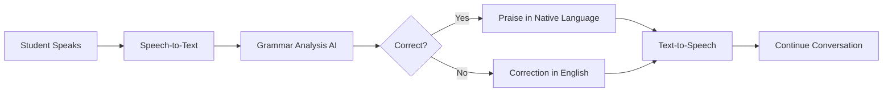

# AI Voice Tutor 🎤

A multi-language voice tutoring application that helps children aged 5-15 learn and improve native language speaking skills through real-time conversation with AI-powered grammar correction.


## 🌟 Features

- **6 Indian Languages Supported:**
  - 🇮🇳 தமிழ் (Tamil)
  - 🇮🇳 हिंदी (Hindi)
  - 🇮🇳 తెలుగు (Telugu)
  - 🇮🇳 മലയാളം (Malayalam)
  - 🇮🇳 ಕನ್ನಡ (Kannada)
  - 🇮🇳 বাংলা (Bengali)

- **Intelligent Features:**
  - ✅ Real-time speech-to-text recognition
  - ✅ Word-level grammar correction with explanations
  - ✅ Natural conversation flow
  - ✅ Positive reinforcement and encouragement
  - ✅ Progress tracking and statistics
  - ✅ Adaptive difficulty based on performance

- **Smart Response Logic:**
  - Mistakes explained in **English** for clarity
  - Correct answers praised in **native language** for immersion
  - Auto-translation support for easy language expansion

## 🏗️ Architecture

```
voice-tutor/
├── backend/           # FastAPI server
│   ├── main.py       # API endpoints
│   ├── tutor_engine.py    # Core tutoring logic (21 behavioral rules)
│   ├── groq_client.py     # AI integration
│   ├── language_config.py # Multi-language support
│   └── translator.py      # Auto-translation utility
│
├── frontend/         # React + Vite
│   ├── src/
│   │   ├── App.jsx          # Main application
│   │   ├── components/      # UI components
│   │   ├── hooks/           # Speech API hooks
│   │   └── utils/           # API client
│   └── package.json
│
└── README.md
```

## 🚀 Quick Start

### Prerequisites

- **Python 3.8+**
- **Node.js 16+**
- **Chrome Browser** (recommended for best speech recognition)
- **Groq API Key** (free from [console.groq.com](https://console.groq.com/keys))

### Backend Setup

```bash
cd backend

# Create virtual environment
python3 -m venv venv
source venv/bin/activate  # On Windows: venv\Scripts\activate

# Install dependencies
pip install -r requirements.txt

# Configure environment
cp .env.example .env
# Edit .env and add your Groq API key

# Start server
python main.py
```

Backend runs on **http://localhost:8000**

### Frontend Setup

```bash
cd frontend

# Install dependencies
npm install

# Start development server
npm run dev
```

Frontend runs on **http://localhost:5173**

## 📖 Usage

1. **Open the app** in Chrome: http://localhost:5173
2. **Select language** from the dropdown (top right)
3. **Click microphone** button to start speaking
4. **Allow microphone** permissions when prompted
5. **Speak naturally** in your chosen language
6. **Receive feedback** with corrections and encouragement
7. **Track progress** in the statistics panel

## 🎯 How It Works

### Conversation Flow



### Response Logic

**When Student is WRONG ❌**
```
Response in ENGLISH:
Good try! 🙂
Correct sentence: நான் பள்ளிக்கு போனேன்

Corrections:
• 'school' → 'பள்ளிக்கு' (English word used; use Tamil word)

Now you try saying it.
```

**When Student is CORRECT ✅**
```
Response in NATIVE LANGUAGE:
சரியாக சொன்னாய்! 👏 
உன் பள்ளியில் என்ன படித்தாய்?
```

## 🛠️ Technology Stack

| Component | Technology | Purpose |
|-----------|-----------|---------|
| **Backend** | FastAPI | High-performance async API |
| **AI Engine** | Groq (Llama 3.3 70B) | Grammar analysis & conversation |
| **Frontend** | React 18 + Vite 5 | Modern reactive UI |
| **Speech Input** | Web Speech API | Multi-language STT |
| **Speech Output** | Web Speech API | Multi-language TTS |
| **Translation** | Deep Translator | Auto-translation for new languages |
| **Styling** | Vanilla CSS | Custom animations & gradients |

## 🔑 Key Files

- **`backend/tutor_engine.py`** - Implements 21 behavioral rules for natural tutoring
- **`backend/language_config.py`** - Language-specific phrases and UI text
- **`backend/groq_client.py`** - AI-powered grammar analysis
- **`frontend/src/App.jsx`** - Main application with language selector
- **`frontend/src/hooks/`** - Speech recognition & synthesis hooks

## 📝 Adding New Languages

Thanks to auto-translation, adding a new language takes minutes:

```python
from translator import auto_generate_language_config

# Auto-generate config for any language
gujarati_config = auto_generate_language_config('gujarati')

# Add to SUPPORTED_LANGUAGES in language_config.py
# Done! Full support with UI text, phrases, and grammar analysis
```

## 🧪 Testing

```bash
# Backend - Grammar analysis tests
cd backend
python test_grammar.py

# Backend - Response language logic
python test_response_language.py
```

## 📊 Features in Detail

### Grammar Correction
- Word-level error detection
- Specific correction reasons in English
- Mixed language detection (English in native speech)
- Grammar particle verification
- Verb conjugation checking

### Natural Conversation
- Context-aware follow-up questions
- Adaptive difficulty (beginner/intermediate/advanced)
- Short answer detection
- Encouragement and positive reinforcement
- Progress celebration

### Progress Tracking
- Total conversations count
- Corrections made
- Accuracy percentage
- Achievement badges
- Session statistics

## 🌐 Browser Compatibility

| Browser | Tamil STT | Tamil TTS | Recommendation |
|---------|-----------|-----------|----------------|
| **Chrome** | ✅ Excellent | ✅ Excellent | **Recommended** |
| **Edge** | ✅ Good | ✅ Good | Good alternative |
| **Firefox** | ⚠️ Limited | ⚠️ Limited | Not recommended |
| **Safari** | ⚠️ Limited | ⚠️ Limited | Not recommended |

## 🔒 Environment Variables

Create a `.env` file in the `backend/` directory:

```env
GROQ_API_KEY=your_groq_api_key_here
BACKEND_PORT=8000
FRONTEND_URL=http://localhost:5173
```

## 📚 Documentation

- **`IMPROVEMENTS.md`** - Grammar parsing enhancements
- **`TRANSLATION_OPTIONS.md`** - Translation method comparison
- **`RESPONSE_LANGUAGE_STRATEGY.md`** - Response logic explanation
- **`ADD_LANGUAGE_DEMO.md`** - Guide for adding new languages
- **`QUICKSTART.md`** - Quick usage guide

## 🤝 Contributing

Contributions are welcome! Areas for improvement:
- Add more Indian languages (Gujarati, Marathi, Punjabi, etc.)
- Improve speech recognition accuracy
- Add pronunciation feedback
- Create mobile app version
- Add user authentication
- Implement learning analytics

## 📄 License

MIT License - feel free to use for educational purposes

## 🙏 Acknowledgments

- **Groq** - For fast AI inference
- **Web Speech API** - For browser-based voice recognition
- **Deep Translator** - For multi-language support
- **AI4Bharat** - Inspiration for Indian language NLP

## 📞 Support

For issues or questions:
1. Check documentation in the repo
2. Open an issue on GitHub
3. Verify Groq API key is correctly set

---

**Made with ❤️ for language learners**

*Helping children aged 5-15 master their native languages through natural conversation*
